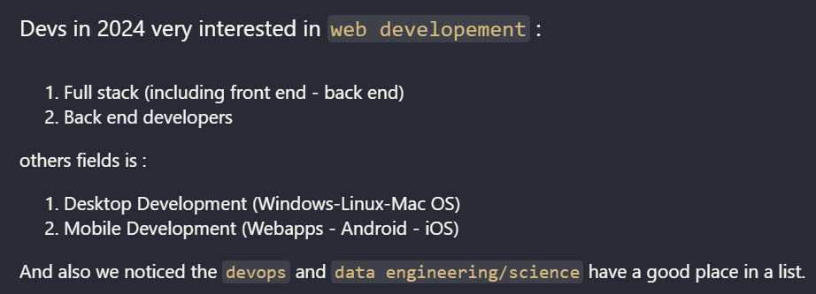

<h1 style="text-align:center;"> Comparative Analysis of Developer Surveys : StackOverflow 2017 vs 2024 </h1>

<a href="https://saadthelegend.netlify.app">
<h4 style="text-align:center;">Saad Almalki - Independent Researcher</h4>
</a>

### Introduction
This paper presents a basic analysis and comparison between the 2017 and 2024 Stackoverflow Developer Surveys. 
This including trend programming languages , job roles, and most famous fields . 
The results show an increase of using python language , and continued dominance of JavaScript, and founded more roles of data science field .

### Goals
- Important of StackOverflow surveys
- Why choosing 2024 and 2017 surveys to comparison ?
- Goals : Languages , tools and database systems comparison - Job roles - and more skills

### Methodology
#### Datasets

In this research and analysis i using two datasets and that's it :
- Stack Overflow Developer Survey 2017 (Udacity).  
- Stack Overflow Developer Survey 2024 (Kaggle).  

#### Tools

- Python 
- Jupyter Notebook
- Pandas
- Matplotlib

#### Steps

1. Data Cleaning : Cleaning nulls and unused data on datasets and prepare it to Data analysis. 
2. Basic Data Analyzing : Using pandas library to show rows and columns . 
3. Visualizations and statistical comparison : Using Matplotlib library.

### Results

#### Programming Languages
- The analysis indicates significant growth in AI and data science languages and tools is more growth up last 7 years.
- Web development has been at the forefront using HTML, CSS, and JavaScript.

#### Job Roles
- Strong growth in web jobs (back-end, front-end, and full-stack), as well as in artificial intelligence. 
- Data science and engineering jobs have remained stable.
- While some jobs , such as software developers and mobile developers, are declining and decreasing .

#### Top 10 famous languages and informations about it

- 10 C Language

General-purpose programming language created in 1970 by Dennis Ritchie. C is mother of most programming languages , and using widely in Low level programming and system programming.

- 9 C++

High level famous programming language , is an extension of C with OOP techniques. Still using in Video games development, Machine learning, Software development, Servers, and System programming.

- 8 C#

A small member of the C family, it was created in 2000 by Microsoft after a war with Sun Microsystems and the Java language. The language is excellent for developing desktop applications (especially Windows), and it is also used in developing games and back-end web development.

- 7 Java

Java is a high-level, general-purpose programming language developed by Sun Microsystems in the 1990s and released in 1995, It's used for developing Android applications, backend web development (Spring), and mods for the popular Minecraft game (Forge - Fabric and more...).
The language remains highly sought-after in the job market.

- 6 Bash

Bash and Shell Languages ​​in General .
Bash, Batch, and others are terminal languages ​​used in command lines in Windows, Linux, and other languages. They are of great importance to programmers (especially due to their connection to Git), They are also languages ​​of interest to cybersecurity specialists and Linux enthusiasts.

- 5 TypeScript

Created by Microsoft in 2012, TypeScript is like C++ for C.

It's a powerful improvement over JavaScript, also popular in web development, and has fixed many of its flaws, including increased flexibility, With the web being one of the most popular fields, it's no surprise that TypeScript exists.

- 4 Python

Python
Designed by Guido van Rossum in 1991, it is now a versatile and comprehensive language for use in everything from back-end web development to game development, data analysis, scientific computing, and even cybersecurity software.

It's a highly sought-after language with a distinctive style that's easy for beginners.

- 3 SQL

SQL or **Structured Query Language**.
It's not programming language. But a queries and database language that performs the functions of both
1. DML : Data Manipulation Language
2. DDL : Data Definition Language

And it's very important for data analysis, web development, and other fields .

- 2 HTML/CSS

Html or **Hypertext markup language** and Css or **Cascading style sheets**.

HTML and CSS is markup languages not a programming languages , while not programming languages, remain foundational technologies for web development.

HTML was created by Tim Berners-Lee (who created the web from browser to web server and beyond) , It's presence here signifies the vast supremacy of the web , And CSS is created to styling html pages and improving responsive pages.

- 1 JavaScript

The high-level language of web , This language was named in 1995 after the popularity of Java and the trademark owned by Sun Microsystems and then Oracle.

It is the language that made the web interactive, but its extreme flexibility and perceived lack of popularity have led people to turn to its own frameworks (React, Angular, and NextJS) more recently.

JavaScript was browser-only from 1995 to 2009 (the release of NodeJS). After the release of Node, it became a server-side and client-side language.

### Summary

I comparised between 2017 and 2024 most famous languages and other general informations , down is more details (diagrams and more...)

- JavaScript stayed dominant: ~36,000 users in 2024 vs ~17,000 in 2017 (nearly +110% growth). HTML/CSS rose from ~17,200 (2017) to ~31,000 (2024) (+80% growth)with TypeScript entered top 5 by 2024 with ~22,000 users — not in 2017’s top 10, indicating rapid adoption. this showing web’s lasting dominance.
- Python nearly tripled: ~29,500 users in 2024 vs ~10,700 in 2017 (+175% growth) — driven by AI/ML adoption and growthing of data science community .
- SQL stayed strong but relatively stable: ~30,000 in 2024 vs ~18,500 in 2017 (Just about +62% growth).
- Java still same : ~17,500 (2017) → ~17,000 (2024) (−3%).
- C# similar stagnation: ~8,500 (2017) → ~16,000 (2024) (+90%, but slower compared to web/data and other languages) .
- C/C++ are both decreased in relative ranking, but still used (~12k for C, ~13k for C++ in 2024).
- PHP dropped out of the top 10 by 2024 (have about ~9,800 users in 2017) .
- Shell/Bash entered the list (~20,000 in 2024), growth in DevOps/Linux fields.

##### 2024 Top 10 languages :

##### 2017 Top 10 languages :

##### 2024 Top 10 DBMS :

| Top 10 Jobs in 2024  | Comment |
|--------|--------|
|  |  |

#### Resources :

##### Source code :

- [My analysis for Stack Overflow Developer Survey 2024](https://github.com/Saad711T/Stackoverflow-2024-Survey-Analysis)
- [My analysis for Stack Overflow Developer Survey 2017](https://github.com/Saad711T/Udacity-IntroductionToDataScience)

##### Data :

- [Stack Overflow Developer Survey 2024 Data](https://www.kaggle.com/datasets/berkayalan/stack-overflow-annual-developer-survey-2024)
- [Stack Overflow Developer Survey 2017 Data](https://survey.stackoverflow.co/2017)
